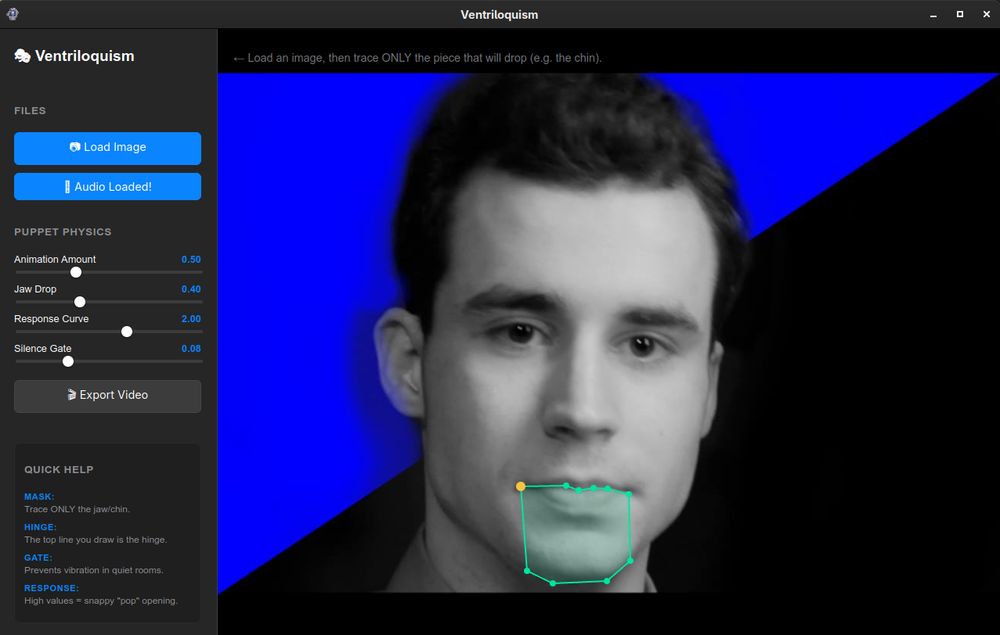

# 🎭 Ventriloquism Studio
### A Moribund Institute Project

**Ventriloquism Studio** is a simple but powerful tool that turns a still photo into a talking puppet. By using sound recordings, the app automatically makes the puppet's mouth move in sync with the voice. It was built for the **Moribund Institute** to help nerds make goofy educational Monty-Python-esque videos.



---

## ✨ The Big Idea
Imagine you have a photo of a historical figure or a character. Usually, making that photo "talk" would take hours of manual work. This app does the heavy lifting for you:
* **Automatic Lip-Sync:** It listens to the audio and moves the puppet's mouth for you.
* **Puppet Physics:** The movements are smooth and feel like a real puppet.
* **Signature Look:** The app is designed with a high-contrast, "Old World" scholarly look, featuring our trademark **Purple Ink** accents.

---

## 🛠️ How It Works (The "Engine")
We used two special technologies to make this app work on any computer:

1. **Tauri (The Bridge):** Think of this as a bridge. It allows us to build the "face" of the app using the same tools people use to build websites, while the "brain" of the app uses a super-fast language called **Rust** to handle the sound and movement.
2. **Flatpak (The Lunchbox):** To make sure the app works on any Linux computer, we package it like a lunchbox. It contains all the "ingredients" (code and tools) the app needs to run, so you don't have to worry about missing parts on your system.

---

## 🚀 Getting Started
If you want to run this project on your own computer, follow these simple steps.

### 1. Grab the Code
Open your terminal and type:
```bash
git clone https://github.com/MoribundInstitute/ventriloquism-studio.git
cd ventriloquism-studio
```

### 2. Install the "Ingredients"
You will need a tool called **npm** (a package manager) installed. Once you have it, run:
```bash
npm install
```

### 3. Run the App
To start the app in "Live Mode" so you can see your changes instantly, run:
```bash
npm run tauri dev
```

---

## 🖥️ Recommended Setup for Builders
If you are a developer looking to help us improve the puppet engine, we recommend using these tools:

* **VS Code:** The best text editor for this project.
* **Tauri Extension:** Helps you see how the app is performing.
* **Rust-analyzer:** A "spellchecker" for the backend code.

---

## ⚖️ License
This project is open-source and free to use under the **MIT License**.

[How to use Tauri for Desktop Apps](https://www.youtube.com/watch?v=Aatf7pXN7kU)

This video is a great primer for beginners who want to understand how Tauri bridges web tools with desktop power, making it perfect for anyone looking to understand the "engine" behind Ventriloquism Studio.
